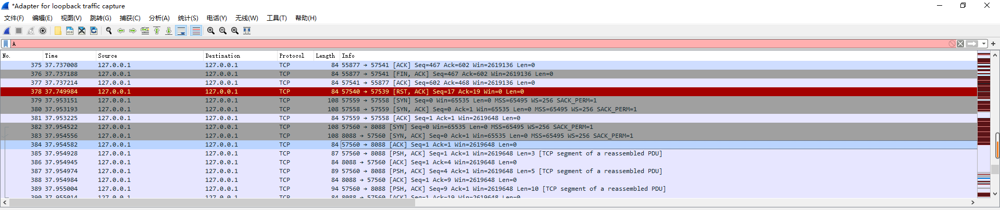
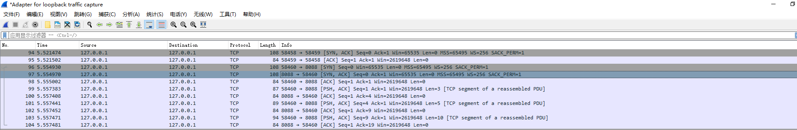
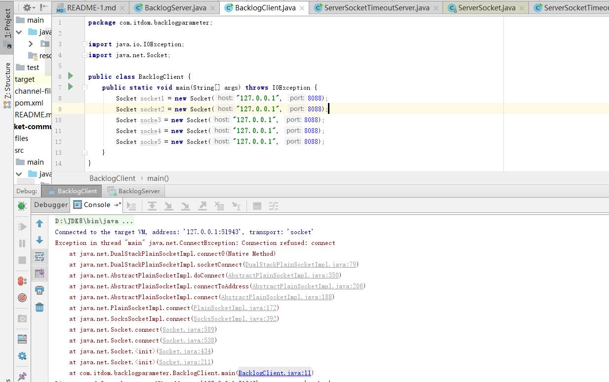
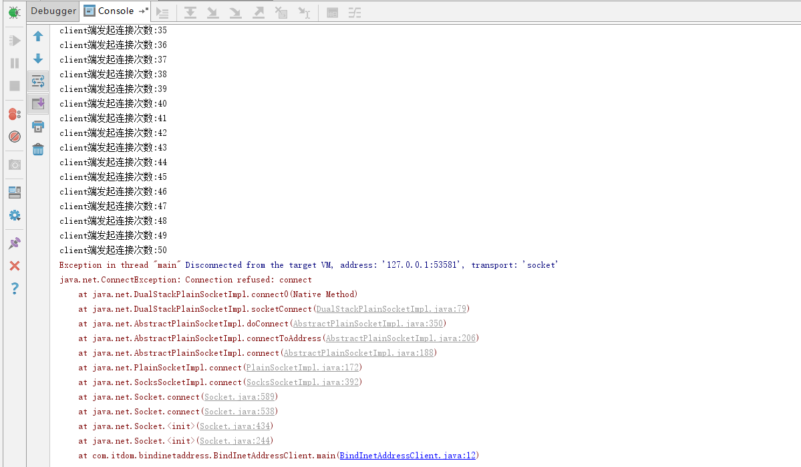

# 实现socket通信


## 基于TCP的Socket通信
```text
  TCP提供了基于"流"的"长连接"的数据传递，发送的数据带有顺序性。TCP是一种流协议，以流为单位进行数据传输。
  长连接：可以实现当服务端与客户端连接成功之后连续恶的传输数据,在这个过程中，连接保持开启的状态，数据传输完毕之后不关闭
长连接是值建立Socket连接后，无论是否使用这个连接，该连接都会保持连接的状态.
  短链接：短链接是当服务端与客户端连接成功之后开始传输数据，数据传输完毕后则连接立即关闭，如果还想再此传输数据，则需要再次  
创建新的连接.
  连接：在TCP/IP中，连接可以认为是服务端与客户端确认彼此都存在的过程。这个过程的实现需要创建连接，如何创建连接(环境)，需要
需要客户端与服务单进行3此握手，握手成功之后，说明服务端与客户端之间实现了数据的通信。如果建立连接的过程是成功的，就说明连接被成功的创建
在创建好的1个连接中，使用TCP可以实现多次的数据通信。在多次的数据通信的过程中，服务端与客户端要进行彼此都存在的过程验证，也
就是验证连接是否正常。

长连接的优缺点
    优点:除了第一次之外，客户端不需要每次传输数据是否写于服务端进行握手，这样就减少了握手的确认时间，直接传输数据，提供了程序
    的运行效率。
    缺点：在服务端保存多个Socket对象，大量占用服务器的资源。
短链接的优缺点
    优点:在服务端不需要保存多个Socket对象，降低了内存的占用率。
    缺点:每次传输数据前都需要重新的创建连接，也就是每次都要进行3次握手，增加了处理的时间.
  
```

## 关闭Stream的close()方法造成Socket关闭
**服务端**
```text
public class CloseStreamServer {
    public static void main(String[] args) {
        try {
        byte[] charArray = new byte[10];
            ServerSocket serverSocket = new ServerSocket(8088);
            Socket socket = serverSocket.accept();
            InputStream inputStream = socket.getInputStream();
            int readLength = inputStream.read(charArray);
            while (readLength!=-1){
                String newString = new String(charArray, 0, readLength);
                System.out.println(newString+" "+System.currentTimeMillis());
                readLength = inputStream.read(charArray);
            }
            inputStream.close();
            OutputStream outputStream = socket.getOutputStream();
            socket.close();
            serverSocket.close();
        } catch (IOException e) {
            e.printStackTrace();
        }

    }
}
```
**客户端**
```text
public class CloseStreamClient {
    public static void main(String[] args) throws IOException, InterruptedException {

            Socket socket = new Socket("127.0.0.1", 8088);
            OutputStream outputStream = socket.getOutputStream();
            outputStream.write("just test".getBytes());
            outputStream.close();
            Thread.sleep(Integer.MAX_VALUE);

    }
}
```
先执行服务端的代码，在执行客户端的代码，出现了如下的错误(原因是关闭了流，导致socket也被关闭了)
````text
just test 1594050956917
java.net.SocketException: Socket is closed
	at java.net.Socket.getOutputStream(Socket.java:943)
	at com.itdom.closestreamerror.CloseStreamServer.main(CloseStreamServer.java:23)
````

## TCP/IP三次握手
```text
382	37.954522	127.0.0.1	127.0.0.1	TCP	108	57560 → 8088 [SYN] Seq=0 Win=65535 Len=0 MSS=65495 WS=256 SACK_PERM=1
383	37.954556	127.0.0.1	127.0.0.1	TCP	108	8088 → 57560 [SYN, ACK] Seq=0 Ack=1 Win=65535 Len=0 MSS=65495 WS=256 SACK_PERM=1
384	37.954582	127.0.0.1	127.0.0.1	TCP	84	57560 → 8088 [ACK] Seq=1 Ack=1 Win=2619648 Len=0

解析：
1. 第一次"握手"时，客户端向服务端发送SYN标志位，目的是与服务端建立连接。SYN标志位的值表示发送数据流序列号sequence number
的最大值。例如Seq的值是4,说明在数据流中曾经一共发送了1，2，3，4这四个字节。而在本次"握手"中，Seq的值是0，代表发送数据流的
大小是0，另外，从Len=0也可以看出来是没有数据可以供发送的，客户端仅仅发送了一个SYN标志位到服务端，代表了要进行连接。

2.第二次"握手"时，服务端向客户端发送SYN和ACK标志位，其中ACK标志位表示对接收到的数据报的确认明说嘛服务端接收到了客户端的连接。
ACK=1，表示服务端期待下一次从客户端发送的数据流的序列号时1，而Seq=0代表服务端曾经并没有给客户端发送数据，而本次也没有发送数据。

3.第三次"握手"时，客户端向服务端发送的ACK标志位为1,Seq=1.虽然Seq=1，但是Len=0，说明客户端并没有向服务端发送数据


```



### 标志位SYN与ACK值的自增特性
```text
  下图是通过wireshark抓取的，TCP数据包中的序列好(Sequence Number)不是以保温的数量来进行编号的，而是将传输的所有数据当作
一个字节流，序列号就是整个字节流中的编号。一个TCP数据包中包含多个字节流的数据(即数据段)，而且每个TCP数据包中的数据大小不
一定相同。在建立TCP连接的3次"握手"过程中，通信双方各自已确定了初始的序号x和y,TCP每次传递的报文段当中的序号字段值表示所要
传送本报文中的第一个字节的整体字节流中的序号。
  TCP的报文达到确认(ACK),是对接收到的数据的最高序列高的确认，并且向发送端返回一个下一次接收时期望的TCP数据包序列号(Ack Number)
当客户端第一次调用write("111".getBytes())代码后向服务端传输数据时，客户端发送标志位PSH和ACK，PSH的作用时发送书，让
接收方立即处理。99	5.557383	127.0.0.1	127.0.0.1	TCP	87	58460 → 8088 [PSH, ACK] Seq=1 Ack=1 Win=2619648 Len=3 [TCP segment of a reassembled PDU]
客户端发送Seq=1,Ack=1和Len=3,其中Len=3代表发送数据段的大小为3，数据的内容为"111"。Seq=1代表以前从未传输数据，这是初次传输
Ack=1表示客户端期望服务端返回Seq=1的数据包.
  
````


### TCP断开连接的4次"挥手"过程
```text
TCP断开连接的过程分为以下几个步骤：
1.客户端端到服务端：我要关闭了
2.服务单到客户端：好的，收到
3.服务端到客户端：我也关闭了
4.客户端到服务端：好的，收到
```


### 结合多线程Thread实现通信
服务端的代码如下:
MultithreadingServer.hava和线程类Multithreading.java
```java
public class MultithreadingServer {
    public static void main(String[] args) throws IOException {
        ServerSocket serverSocket = new ServerSocket(8088);
        int runTag = 1;
        while (runTag==1){
            Socket socket = serverSocket.accept();
            Multithreading multithreading = new Multithreading(socket);
            multithreading.start();
        }
        serverSocket.close();
    }
}

public class Multithreading extends Thread {

    private Socket socket;

    public Multithreading(Socket socket) {
        super();
        this.socket = socket;
    }

    @Override
    public void run() {
        try {
            InputStream inputStream = socket.getInputStream();
            OutputStream outputStream = socket.getOutputStream();
            byte[] bytesBuffer = new byte[1024];


            int readLength = inputStream.available();
            double doubleCount = (double) readLength/bytesBuffer.length;
            int intCount = (int) readLength/bytesBuffer.length;
            int count = doubleCount>intCount?intCount+1:intCount;
             int i=0;
             while (i<count){
                 i++;
                 int length = inputStream.read(bytesBuffer);
                 String newString = new String(bytesBuffer, 0, length);
                 System.out.println(newString);
             }
            outputStream.write("accepted....".getBytes());
            Thread.sleep(2000L);
            outputStream.close();
            inputStream.close();
            socket.close();
        } catch (IOException e) {
            e.printStackTrace();
        } catch (InterruptedException e) {
            e.printStackTrace();
        }
    }
}


```

客户端代码MultithreadingClient.java
```java
public class MultithreadingClient {
    public static void main(String[] args) throws IOException, InterruptedException {
        Socket socket = new Socket("127.0.0.1", 8088);
        OutputStream outputStream = socket.getOutputStream();

        int readLength = -1;
        byte[] bytesArray = new byte[1024];
        for (int i = 0; i < 3000; i++) {
            outputStream.write("test multiThreading demo\n".getBytes());
            outputStream.flush();
        }
        InputStream inputStream = socket.getInputStream();
        while ((readLength = inputStream.read(bytesArray)) != -1) {
            String s = new String(bytesArray, 0, readLength);
            System.out.println(s);
        }
        outputStream.close();
        inputStream.close();
        socket.close();
    }
}

```

### 服务端与客户端互相传递对象的以及I/O流顺序问题
```text
正确的对象I/O序列：
1.服务端先获得ObjectInputStream对象，客户端要先获得ObjectOutputStream对象
1.服务端先获得ObjectOutputStream对象，客户端要先获得ObjectInputStream对象

```
服务端的代码
```java
public class ObjectOrderServer {
    public static void main(String[] args) {
        try {
            ServerSocket serverSocket = new ServerSocket(8088);
            Socket socket = serverSocket.accept();
            InputStream inputStream = socket.getInputStream();
            OutputStream outputStream = socket.getOutputStream();
            ObjectInputStream objectInputStream = new ObjectInputStream(inputStream);
            ObjectOutputStream objectOutputStream = new ObjectOutputStream(outputStream);
            for (int i = 0; i < 5; i++) {
                UserInfo userInfo = (UserInfo)objectInputStream.readObject();
                System.out.println("在服务端接收的对象="+(i+1)+":"+userInfo.getId()+"-"+userInfo.getUsername()+"-"+userInfo.getPassword());

                UserInfo newUserInfo = new UserInfo();
                userInfo.setId((long) (i+1));
                userInfo.setUsername("serverUsername:"+userInfo.getUsername());
                userInfo.setPassword("serverPassword:"+userInfo.getPassword());
                objectOutputStream.writeObject(newUserInfo);
            }
            objectOutputStream.close();
            objectInputStream.close();
            outputStream.close();
            inputStream.close();
            serverSocket.close();
        } catch (IOException e) {
            e.printStackTrace();
        } catch (ClassNotFoundException e) {
            e.printStackTrace();
        }finally {

        }
    }
}
```

客户端的代码

```java

public class ObjectOrderClient {
    public static void main(String[] args) {
        try {
            Socket socket = new Socket("127.0.0.1", 8088);
            InputStream inputStream = socket.getInputStream();
            OutputStream outputStream = socket.getOutputStream();
            ObjectOutputStream objectOutputStream = new ObjectOutputStream(outputStream);
            ObjectInputStream objectInputStream = new ObjectInputStream(inputStream);
            for (int i = 0; i < 5; i++) {
                UserInfo userInfo = new UserInfo();
                userInfo.setId((long) (i + 1));
                userInfo.setUsername("clientUsername:" + (i + 1));
                userInfo.setPassword("clientPassword:" + (i + 1));
                objectOutputStream.writeObject(userInfo);
                UserInfo acceptUserInfo = (UserInfo) objectInputStream.readObject();
                System.out.println("在客户端" + (i + 1) + ":" + userInfo.getId() + "-" + userInfo.getUsername() + "-" + userInfo.getPassword());
            }
            objectOutputStream.close();
            objectInputStream.close();
            outputStream.close();
            inputStream.close();
            socket.close();
        } catch (IOException e) {
            e.printStackTrace();
        } catch (ClassNotFoundException e) {
            e.printStackTrace();
        }
    }
}

```


## ServerSocket类的使用
```text
  ServerSocket类中有很多的方法，熟悉这些方法的功能与使用是掌握Socket的基础.
```
### 接收accept与超时Timeout
```text
  accept()方法的主要作用就是侦听次套接字的连接，此方法在传入之前一直是阻塞的。setSoTimeout(timeout)方法的作用是设置超时时间
通过知道超时时间timeout值启用/禁用SO_TIMEOUT,以ms为单位，如果此方法设置为0,表是无限的等待。如果设置了，但是在这个时间段内
没有收到请求，那么就会引发SocketTimeoutException,但是ServerSocket还是有效的，
```
```java
public class ServerSocketTimeoutServer {
    public static void main(String[] args) {
        ServerSocket serverSocket = null;
        try {
            serverSocket = new ServerSocket(8088);
            System.out.println(serverSocket.getSoTimeout());
            serverSocket.setSoTimeout(4000);
            System.out.println();
            System.out.println("begin:"+System.currentTimeMillis());
            serverSocket.accept();
            System.out.println("end:"+System.currentTimeMillis());
        } catch (IOException e) {
            e.printStackTrace();
            System.out.println("catch"+System.currentTimeMillis());
            try {
                Socket accept = serverSocket.accept();
            } catch (IOException e1) {
                e1.printStackTrace();
            }
        }
    }
}
```

### 构造方法backlog参数含义
```text
   public ServerSocket(int port, int backlog)方法中的backlog的参数的主要作用就是允许接收客户端连接请求的个数。客户端很多连接
 进入操作系统中，将这些连接放入操作系统的队列中，当执行accept()方法是，允许客户端的的连接个数要取决于这个backlog参数。
   传入的backlog参数的作用是设置最大等待队列的长度，如果队列已满，则拒绝该连接。
   backlog参数必须是大于0的正值，如果传递的值等于或者效于0，则使用默认值50
```
**例子展示**
```java
public class BacklogServer {
    public static void main(String[] args) throws IOException, InterruptedException {
        ServerSocket serverSocket = new ServerSocket(8088, 3);
        Thread.sleep(5000);

        System.out.println("accept1 begin");
        Socket socket1 = serverSocket.accept();
        System.out.println("accept1 end");

        System.out.println("accept2 begin");
        Socket socket2 = serverSocket.accept();
        System.out.println("accept2 end");


        System.out.println("accept3 begin");
        Socket socket3= serverSocket.accept();
        System.out.println("accept3 end");


        System.out.println("accept4 begin");
        Socket socket4= serverSocket.accept();
        System.out.println("accept4 end");


        System.out.println("accept5 begin");
        Socket socket5= serverSocket.accept();
        System.out.println("accept5 end");

        socket1.close();
        socket2.close();
        socket3.close();
        socket4.close();
        socket5.close();
        serverSocket.close();
    }
}
//----------------------------------------------------------------------------------
public class BacklogClient {
    public static void main(String[] args) throws IOException {
        Socket socket1 = new Socket("127.0.0.1", 8088);
        Socket socket2 = new Socket("127.0.0.1", 8088);
        Socket socke3 = new Socket("127.0.0.1", 8088);
        Socket socke4 = new Socket("127.0.0.1", 8088);
        Socket socke5 = new Socket("127.0.0.1", 8088);
    }
}
// 运行得到的结果如下图所示：
```


### 构造方法public ServerSocket(int port, int backlog, InetAddress bindAddr)的使用

```text
  该方法的作用指定port和backlog将socket绑定到本地InetAddress bindAddr来创建服务器。bindAddr参数可以在ServerSocket的多宿主主机
上使用，ServerSocket仅接收对其多个地址的其中一个的连接请求。如果bindAddr为null，则默认接收任何/所有本地地址上的连接。注意，端口号必须
是0-65535，多宿主主机表示一台计算机有两块网卡，每块网卡有不同的IP地址，也有可能只有一块网卡，但是这块网卡有多个IP地址的情况。

```
例子：
```java
public class BindInetAddressServer {
    public static void main(String[] args) throws IOException, InterruptedException {
        InetAddress localHost = InetAddress.getLocalHost();
        ServerSocket serverSocket = new ServerSocket(8088, 50, localHost);
        Thread.sleep(50000);
        for (int i = 0; i < 100; i++) {
            System.out.println("accept1 begin:"+(i+1));
            Socket socket = serverSocket.accept();
            System.out.println("accept1 end:"+(i+1));
        }
    }
}
//-------------------------------------------------------------------------------------------------------
public class BindInetAddressClient {
    public static void main(String[] args) throws IOException {
        InetAddress localHost = InetAddress.getLocalHost();
        for (int i = 0; i < 100; i++) {
            Socket socket = new Socket(localHost, 8088);
            System.out.println("client端发起连接次数:"+(i+1));
        }
    }
}

```


### 绑定到指定的Socket地址
```text
    public void bind(SocketAddress endpoint)方法的主要作用是将ServerSocket绑定到特定的Socket地址(IP地址和端口号)，使用这个
 地址与客户端进行通信。如果地址为null，则系统将挑选一个临时端口号和一个有效本地地址来绑定套接字。该方法的使用场景就是在使用
 ServerSocket类无参构造方法后指定本地端口。
 
 InetSocketAddress类有3个构造方法：
 1. public InetSocketAddress(int port)指定端口创建套接字端口号0-65535,端口号传入0表示任意端口。
 2.  public InetSocketAddress(InetAddress addr, int port) 根据主机名和端口号创建套接字地址
 3. public InetSocketAddress(InetAddress addr, int port)根据IP地址和端口号创建套接字。


```
### 绑定到指定的Socket地址并设置backlog数量
```text
 public void bind(SocketAddress endpoint, int backlog)不仅可以绑定到 指定IP，而且还可以设置backlog的连接数量。
```

### 获取本地SocketAddress对象以及本地端口
```text
   getLocalSocketAddress()方法用来获取本地的SocketAddress对象，它返回此Socket绑定的端点的地址，如果尚未绑定，则返回null.
getLocalPort()方法来获取Socket绑定到本地的端口,InetSocketAddress类主要表示Socket的IP地址，而InetAddress类主要表示一个IP地址
```
**例子：**
```java
public class SocketAddressServer {

    public static void main(String[] args) throws IOException {
        ServerSocket serverSocket = new ServerSocket();
        System.out.println("new ServerSocket()无参构造的端口是:" + serverSocket.getLocalPort());

        serverSocket.bind(new InetSocketAddress("127.0.0.1", 8088));

        System.out.println("调用完bind:" + serverSocket.getLocalPort());

        InetSocketAddress inetSocketAddress = (InetSocketAddress) serverSocket.getLocalSocketAddress();

        System.out.println("inetSocketAddress.getHostName=" + inetSocketAddress.getHostName());
        System.out.println("inetSocketAddress.getHostString=" + inetSocketAddress.getHostString());
        System.out.println("inetSocketAddress.getPort=" + inetSocketAddress.getPort());
        serverSocket.close();

    }
}

```
**运行结果**
```text

new ServerSocket()无参构造的端口是:-1
调用完bind:8088
inetSocketAddress.getHostName=127.0.0.1
inetSocketAddress.getHostString=127.0.0.1
inetSocketAddress.getPort=8088

```


### 获取IP地址InetAddress对象
```text
 public final InetAddress getAddress()方法可以获取InetAddress对象
```
**例子**
```java
public class AddressServer {
    public static void main(String[] args) {
        InetSocketAddress inetSocketAddress = new InetSocketAddress("127.0.0.1", 8088);
        InetAddress address = inetSocketAddress.getAddress();
        byte[] ipAddress = address.getAddress();
        for (int i = 0; i < ipAddress.length; i++) {
            System.out.print((byte)ipAddress[i]+" ");
        }
    }
}

```

### 创建未解析的套接字地址
```text
  public static InetSocketAddress createUnresolved(String host, int port) 方法的作用是根据主机名和端口号创建未解析的套接字
地址，但不会尝试将主机名解析未InetAddress。该方法将地址标记未未解析，有效地址介于0-65535之间，
```
**例子：**
```java
public class UnresolvedServer {
    public static void main(String[] args) {
        InetSocketAddress inetSocketAddress = new InetSocketAddress("www.baidu.com",80);
        System.out.println(inetSocketAddress.isUnresolved());

        InetSocketAddress inetSocketAddress2 = new InetSocketAddress("www.baidu.askdhajhdasjdhasj.com",80);
        System.out.println(inetSocketAddress2.isUnresolved());


        InetSocketAddress unresolved = InetSocketAddress.createUnresolved("www.baidu.com", 80);
        System.out.println(unresolved.isUnresolved());

        InetSocketAddress unresolved2 = InetSocketAddress.createUnresolved("www.baidu.1371823dsjdas.com", 80);
        System.out.println(unresolved2.isUnresolved());


    }
}
```
**执行结果:**

```java
false
true
true
true
```


### 关闭于获取关闭状态
```text
  public void close()方法的作用就是关闭此套接字。在accept()中，所有当前阻塞的线程都会抛出SocketExcception.如果此套接字有一个
与之关联的通道，则关闭该通道。
 
```
**例子：**
```java
public class CloseSocketServer {
    public static void main(String[] args) {
        try {
            ServerSocket serverSocket = new ServerSocket(8088);
            System.out.println(serverSocket.isClosed());
            serverSocket.close();
            System.out.println(serverSocket.isClosed());
            } catch (IOException e) {
            e.printStackTrace();
        }
    }
}
```

### 判断Socket的绑定状态
```text
 public boolean isBound() 的作用是返回ServerSocket的绑定状态,如果将ServerSocket成功的绑定到一个地址，则返回true.
```
**例子**
```java
public class BindServer {
    public static void main(String[] args) {
        try {
            ServerSocket serverSocket = new ServerSocket();
            System.out.println("bind begin "+serverSocket.isBound());
            serverSocket.bind(new InetSocketAddress("127.0.0.1",8088));
            System.out.println("begin end "+serverSocket.isBound());

        } catch (IOException e) {
            e.printStackTrace();
        }
    }
    }
/**执行结果
bind begin false
begin end true    
**/
```
### 获取IP地址
```text
java.net.InetAddress.getHostAddress()方法用来获取Socket绑定的本地IP地址信息.如果Socket是未绑定的，则该方法返回null
```
**例子**
```java
public class GetHostServer {
    public static void main(String[] args) {
        try {
            ServerSocket serverSocket = new ServerSocket();
            serverSocket.bind(new InetSocketAddress("127.0.0.1",8088));
            System.out.println(serverSocket.getInetAddress().getHostAddress());
            System.out.println(serverSocket.getInetAddress().isLoopbackAddress());
        } catch (IOException e) {
            e.printStackTrace();
        }
    }
    }
    /*
    执行结果:
    127.0.0.1
    true 
     */
```


### Socket选项的ReuseAddress
```text
   public void setReuseAddress(boolean on)方法的作用是启用/禁用SO_REUSEADDR套接字选项。关闭TCP连接时，该连接可能在关闭
的一段时间内保持超时状态(通常称为TIME_WAIT状态或者2MSL等待状态).对于使用已知的套接字地址或者端口应用的程序而言，如果存在
处于超时状态的连接(包括地址和端口)，则应用程序可能不能将套黑子绑定到所需要的SocketAddress上。如果早bind(SocketAddress)方法
"绑定套接字之前"启用了SO_REUSEADDR时的行为时不确定的，也依赖于操作系的实现。
   TIME_WAIT状态就是服务端于客户端建立TCP连接之后，主动关闭连接的一方会进入TIME_WAIT状态。例如，客户端主动关闭连接时，
会发送最后的ACK,然后客户端就会进入TIME_WAIT状态，再"停留若干时间"，然后进入CLOSED状态。在Linux中，当在TIME_WAIT的时间店，应用
程序可以复用TIME_WAIT的端口，那么就可以提示利用率。

```


### Socket选项的ReceiveBufferSize
```text
  public synchronized void setReceiveBufferSize(int var1)方法的作用时未从此ServerSocket接收的套接字SO_RECVBUF选项设置新的建议值。
在接收的的套接字中，实际被踩奶的值必须在accept()方法返回套接字后通过调用Socket.getReceiveBufferSize()方法进行获取.
  SO_RCVBUF的值用于设置内部套接字接收缓冲区的大小和设置公布到远程同位体的TCP接收窗口的大小。随后可以通过Socket.setReceiveBuffetSize(int)f
方法改变该值。但是，如果应用程序希望允许大于RFC 1323中定义的64KB的接收窗口，则在将ServerSocker绑定到本地之前必须在其中设置建议值
。当然，不在bind之前设置该接收缓冲区的大小也不会有错，就是其值的不到预期正确的修改
```
**例子:**
```java
public class ReceiveBufferServer {
    public static void main(String[] args) {
        try {
            ServerSocket serverSocket = new ServerSocket();
            System.out.println("A server serverSocket.getReceiveBufferSize()="+serverSocket.getReceiveBufferSize());
            serverSocket.setReceiveBufferSize(66);
            System.out.println("B server serverSocket.getReceiveBufferSize()="+serverSocket.getReceiveBufferSize());
            serverSocket.bind(new InetSocketAddress("localhost",8088));
            Socket socket = serverSocket.accept();
            InputStream inputStream = socket.getInputStream();
            InputStreamReader inputStreamReader = new InputStreamReader(inputStream);
            char[] charArray = new char[1024];
            int readLength = inputStreamReader.read(charArray);
            while (readLength!=-1){
                String s = new String(charArray, 0, readLength);
                System.out.print(s);
                readLength = inputStreamReader.read(charArray);
            }
            socket.close();
            serverSocket.close();
        } catch (IOException e) {
            e.printStackTrace();
        }
    }
}
//-----------------------------------------------client-------------------------------------------
public class ReceiveBufferClient {
    public static void main(String[] args) {
        try {
            Socket socket = new Socket();

            System.out.println("begin "+socket.getReceiveBufferSize());
            socket.connect(new InetSocketAddress("localhost",8088));
            System.out.println("end "+socket.getReceiveBufferSize());
            OutputStream outputStream = socket.getOutputStream();
            for (int i = 0; i < 100; i++) {
                outputStream.write(("2131231231287381237128371237237123632173621736127361276372136721312312312" +
                        "87381237128371237237123632173621736127361276372136721312312312873812371283712372371" +
                        "23632173621736127361276372136721312312312873812371283712372371236321736217361273612" +
                        "7637213672131231231287381237128371237237123632173621736127361276372136721312312312" +
                        "8738123712837123723712363217362173612736127637213672131231231287381237128371237237" +
                        "1236321736217361273612763721367213123123128738123712837123723712363217362173612736" +
                        "1276372136721312312312873812371283712372371236321736217361273612763721367213123123" +
                        "12873812371283712372371236321736217361273612763721367213123123128738123712837123723" +
                        "71236321736217361273612763721367213123123128738123712837123723712363217362173612736" +
                        "127637213672131231231287381237128371237237123632173621736127361276372136721312312312" +
                        "873812371283712372371236321736217361273612763721367213123123128738123712837123723712" +
                        "3632173621736127361276372136721312312312873812371283712372371236321736217361273612763" +
                        "72136721312312312873812371283712372371236321736217361273612763721367213123123128738" +
                        "1237128371237237123632173621736127361276372136721312312312873812371283712372371236" +
                        "21736217361273612763721367213123123128738123712837123723712363217362173612736127637" +
                        "2136721312312312873812371283712372371236321736217361273612763721367213123123128738" +
                        "12371283712372371236321736217361273612763721367213123123128738123712837123723712363" +
                        "21736217361273612763721367213123123128738123712837123723712363217362173612736127637" +
                        "21367213123123128738123712837123723712363217362173612736127637213672131231231287381" +
                        "23712837123723712363217362173612736127637213672131231231287381237128371237237123632" +
                        "173621736127361276372136721312312312873812371283712372371236321736217361273612763721").getBytes());
            }
            outputStream.write("end!".getBytes());
            outputStream.close();
            socket.close();

        } catch (Exception e) {
            e.printStackTrace();
        }
    }
}
```

## Socket类的使用

### 绑定bind与connect以及端口生成的时机
```text
   public void bind(SocketAddress var1) 方法的作用时将套接字绑定到本地的地址。如果地址未null,则系统随机挑选一个空闲的端口
和一个有效的本地地址来绑定套接字。正常情况下客户端时没有指定绑定的地址的，但是，事实上客户端可以使用bind()方法来提供bind()
方法来将客户端绑定到指定的端口.
```
**例子**
```java
//----------------------------------------server--------------------------------------------
public class ClientBindServer {
    public static void main(String[] args) {
        try {
            ServerSocket serverSocket = new ServerSocket(8088);
            Socket socket = serverSocket.accept();
            socket.close();
            serverSocket.close();
            System.out.println("server end");
        } catch (IOException e) {
            e.printStackTrace();
        }
    }
}
//------------------------------------------client-----------------------------------------------
public class ClientBindClient {
    public static void main(String[] args) throws IOException {
        Socket socket = new Socket();
        socket.bind(new InetSocketAddress("localhost",9000));
        socket.connect(new InetSocketAddress("localhost",8088));
        socket.close();
        System.out.println("client end!");
    }
}
//-----------------------执行结果-----------------------------------
server end;
client end!
```
### 获取远程端口与本地端口
```text
public int getPort()方法的作用时返回此套接字连接到的远程端口
public int getLocalPort()方法的作用时返回此套接字的绑定到的本地端口

```

**例子：**
```java
public class PortServer {
    public static void main(String[] args) {
        try {
            ServerSocket serverSocket = new ServerSocket(8088);
            Socket socket = serverSocket.accept();
            System.out.println("服务端输出：");
            System.out.println("服务端的端口号socket.getLocalPort():"+socket.getLocalPort());
            System.out.println("客户端的端的端口号socket.getPort():"+socket.getPort());
            socket.close();
            serverSocket.close();

        } catch (IOException e) {
            e.printStackTrace();
        }
    }
}
//---------------------------------------------------------------------------------------------------------------------
public class PortClient {
    public static void main(String[] args) throws IOException {
        Socket socket = new Socket();
        socket.bind(new InetSocketAddress("127.0.0.1",8080));
        socket.connect(new InetSocketAddress("localhost",8088));
        System.out.println("客户端的端口号socket.getLocalPort():"+socket.getLocalPort());
        System.out.println("服务端的端口号socket.getPort():"+socket.getPort());


    }
}
```


###  获取本地InetAddress地址与本地SocketAddress地址
```text
java.net.Socket.getInetAddress放啊的作用时获取套接字的绑定的本地InetAddress地址信息
java.net.Socket.getLocalSocketAddress方法的作用时返回此套接字的绑定的端点的Socket-Address地址信息.如果尚未绑定，则返回null
```
**例子:**
```java
public class AddressServer {
    public static void main(String[] args) {
        try {
            ServerSocket serverSocket = new ServerSocket(8088);
            Socket socket = serverSocket.accept();
            InetAddress inetAddress = socket.getLocalAddress();
            InetSocketAddress inetSocketAddress = (InetSocketAddress)socket.getLocalSocketAddress();
            byte[] address = inetAddress.getAddress();
            System.out.println("服务端的IP地址为:");
            for (int i = 0; i < address.length; i++) {
                System.out.print(address[i]+" ");
            }
            System.out.println();
            System.out.println("服务端的端口号："+inetSocketAddress.getPort());


        } catch (IOException e) {
            e.printStackTrace();
        }
    }
}
//---------------------------------------------------client------------------------------------------------------------
public class AddressClient {
    public static void main(String[] args) throws IOException {
        Socket socket = new Socket("127.0.0.1", 8088);
        socket.close();
    }
}
```
### 获取远程InetAddress与远程SocketAddress地址
```text
java.net.Socket.getInetAddress()方法的作用是返回此套接字连接到的远程的InetAddress地址。如果套接字未连接，则返回null
java.net.Socket.getRemoteSocketAddress()方法的作用是返回此陶杰子远程端点的SocketAddress地址，如果未连接，则返回null
```
**例子:**

```java
public class RemoteaddressandsocketaddressServer {
    public static void main(String[] args) throws IOException {
        ServerSocket serverSocket = new ServerSocket(8088);
        Socket socket = serverSocket.accept();
        InetAddress inetAddress = socket.getInetAddress();
        InetSocketAddress inetSocketAddress = (InetSocketAddress) socket.getRemoteSocketAddress();
        byte[] address = inetAddress.getAddress();
        System.out.println("客户端的IP地址为:");
        for (int i = 0; i < address.length; i++) {
            System.out.print(address[i]+" ");
        }
        System.out.println();
        System.out.println("客户端的端口为:"+inetSocketAddress.getPort());
        socket.close();
        serverSocket.close();
    }

}
//-----------------------------------------------------------------client---------------------------------------------
public class RemoteaddressandsocketaddressClient {
    public static void main(String[] args) throws IOException {
        Socket socket = new Socket("localhost", 8088);
        socket.close();
    }
}
/*
运行结果:
客户端的IP地址为:
127 0 0 1 
客户端的端口为:58541

 */
```

### 套接字的状态的判断

```text
public boolean isBound()方法分作用是返回此台阶子的绑定状态，如果将此套接字成功的绑定到了一个地址，则返回true
java.net.Socket.isConnected()方法的作用是返回此套接字的连接状态。如果将套接字成功的连接到服务端，则返回true
java.net.Socket.isClosed()方法的作用是返回套接字的关闭状态。如果已经关闭了套接字，则返回true
```
**例子：**
```java
public class StatusCheckServer {
    public static void main(String[] args) {
        try {
            ServerSocket serverSocket = new ServerSocket(8088);
            Socket socket = serverSocket.accept();
            socket.close();
            serverSocket.close();
        } catch (IOException e) {
            e.printStackTrace();
        }
    }
}
//-----------------------------------client--------------------------------------------------
public class StatusCheckClient {
    public static void main(String[] args) throws IOException {
        Socket socket = new Socket();
        System.out.println("1 socket.isBound()="+socket.isBound());
        socket.bind(new InetSocketAddress("localhost",8000));
        System.out.println("2 socket.isBound()="+socket.isBound());

        System.out.println("3 socket.isConnected()="+socket.isConnected());
        socket.connect(new InetSocketAddress("localhost",8088));
        System.out.println("4 socket.isBound()="+socket.isConnected());


        System.out.println("5 socket.isClosed()="+socket.isClosed());
        socket.close();
        System.out.println("6 socket.isClosed()="+socket.isClosed());


    }
}

```
### 开启半读与半写状态
```text
public void shutdownInput() 方法的作用是将套接字的输入流置于"流的末尾EOF"，也就是在套接字上调用了shutdownInput()方法之后从
套接字输入流读取内容，流将返回EOF(文件结束符)。发送到套接字的输入流端的任何数据都将在确认后被静默丢弃。调用此方法的一端进
入半读状态(read-half)，也就是此端不能获得输入流，但是对端可以获得输入流，一端能都，另一端不能读，称为半读.
 public void shutdownOutput()方法的作用是禁用此套接字的输出流。对于TCP套接字，任何以前写入的数据都将被发送，并且后跟TCP的
 正常连接终止序列。如果在套接字上调用 shutdownOutput()后写入套接字的输出流，则该流将抛出IOException.调用此方的一端进入
 半写状态(write-half)，也就是此端不能获得输出流。但是对端却能获得输出流。一端能写，另一端不能写，称为半写。
```
**例子:**
```java
public class ReadHalfServer {
    public static void main(String[] args) throws IOException {
        ServerSocket serverSocket = new ServerSocket(8088);
        Socket socket = serverSocket.accept();
        InputStream inputStream = socket.getInputStream();
        System.out.println("A="+inputStream.available());
        byte[] bytes = new byte[2];
        int readLength = inputStream.read(bytes);
        System.out.println("server取得的数据："+new String(bytes,0,readLength));
        //服务端关闭读取
        socket.shutdownInput();
        System.out.println("B="+inputStream.available());
        readLength = inputStream.read(bytes);
        System.out.println("readLength="+readLength);
        socket.getInputStream();
        socket.close();
        serverSocket.close();

    }
}
//-------------------------------------------------client--------------------------------------
public class ReadHalfClient {
    public static void main(String[] args) throws IOException {
        Socket socket = new Socket("localhost", 8088);
        OutputStream outputStream = socket.getOutputStream();
        outputStream.write("adhajdsadas".getBytes());
        socket.close();
    }
}
/*
执行结果:
A=0
Exception in thread "main" server取得的数据：ad
B=0
readLength=-1
Disconnected from the target VM, address: '127.0.0.1:61793', transport: 'socket'
java.net.SocketException: Socket input is shutdown
	at java.net.Socket.getInputStream(Socket.java:907)
	at com.itdom.readhalf.ReadHalfServer.main(ReadHalfServer.java:22)


 */
```

### 判断半读半写状态
```text
 public boolean isInputShutdown()方法的作用是返回是否关闭套接字连接的半读状态。如果关闭套接字输入，则返回true
 public boolean isOutputShutdown()方法的作用是返回是否关闭套接字连接的半写庄涛。如果关闭了套接字输出，则返沪true.
```


### Socket选项TcpNoDelay
```text
    public void setTcpNoDelay(boolean on)方法的作用是启用/禁用TCP_NODELAY(启用/禁用Nagle算法).参数为true,表示TCP_NODELAY；参数
 为false表示禁用。
     Nagle 算法最早出现在1 984 年的福特航空和通信公司，是解决TCP/IP 拥塞控制的方
 法。这个算法在当时将福特航空和通信公司的网络拥塞得到了控制，从那以后这一算法得到
 了广泛应用。
 Nagle 算法解决了处理小数据包众多而造成的网络拥塞。网络拥塞的发生是指如果应用
 程序l 次产生1 个字节的数据，并且高频率地将它发送给对方网络，那么就会出现严重的网
 络拥塞。为什么只发送1 个字节的数据就会出现这么严重的网络拥塞呢？这是因为在网络中
 将产生1 个41 字节的数据包，而不是1 个字节的数据包，这4 1 字节的数据包中包括l 字节
 的用户数据以及40 字节的TCP/IP 协议头，这样的情况对于轻负载的网络来说还是可以接
 受的，但是在重负载的福特网络就受不了了，网络拥塞就发生了。
 Nagl e 算法的原理是在未确认ACK 之前让发送器把数据送到缓存里，后面的数据也继
 续放入缓存中，直到得到确认ACK 或者直到“攒到”了一定大小（ size ）的数据再发送。尽
 管Nag l e 算法解决的问题只是局限于福特网络， 然而同样的问题也可能出现在互联网上，因
 此，这个算法在互联网中也得到了广泛推广。
 先来看看不使用Nagle 算法时，数据是如何传输的，过程如图4- 57 所示。
 客户端向服务端传输很多小的数据包，造成了网络的拥塞，而使用Nagle 算法后不再出
 现拥塞了。使用Nagle 算法的数据传输过程是怎样的呢？其过程如图4- 58 所示。
 使用Nagl e 算法的数据传输过程是在第一个ACK 确认之前，将要发送的数据放人缓存
 中，接收到ACK 之后再发送一个大的数据包，以提升网络传输利用率。举个例子，客户端
 调用Socket 的写操作将一个int 型数据123456789 （称为A 块）写人到网络中，由于此时连
 接是空闲的（也就是说，还没有未被确认的小段），因此这个int 类型的数据就会被马上发
 送到服务端。接着，客户端又调用写操作写入“ ＼r\n ”（简称B 块），这个时候，因为A 块的
 ACK 没有返回，所以可以认为A 块是一个未被确认的小段，这时B 块在没有收到ACK 之
 前是不会立即被发送到服务端的，一直等到A 块的ACK 收到（大概40ms 之后）， B 块才被
 第4 章实现Socket 通信•！• 271
 发送。这里还隐藏了一个问题，就是A 块数据的ACK 为什么40ms 之后才收到？ 这是因为
 TCP/IP 中不仅仅有Nagle 算法，还有一个TCP “确认延迟（ Delay) ACK ”机制，也就是当
 服务端收到数据之后，它并不会马上向客户端发送ACK ，而是会将ACK 的发送延迟一段时
 间（假设为t ），它希望在t 时间内服务端会向客户端发送应答数据，这样ACK 就能够和应
 答数据一起发送，使应答数据和ACK 一同发送到对方，节省网络通信的开销。
TCP _NO DEL AY 选项可以控制是否采用Nag le 算法。在默认情况下，发送数据采用的
是Nagle 算法，这样虽然提高了网络吞吐量，但是实时性却降低了，在一些交互性很强的应
用程序中是不允许的。使用TCP_NODELAY 选项可以禁止Nagle 算法。
通过前面的一些知识点的介绍，可以分析出以下两点。
1 ）如果要求高实时性，那么有数据发送时就要马上发送，此时可以将TCP NODELAY
选项设置为true ，也就是屏蔽了Nag le 算法。典型的应用场景就是开发一个网络格斗游戏，
程序设计者希望玩家A 每点击一次按键都会立即在玩家B 的计算机中得以体现，而不是等
到数据包达到最大时才通过网络一次性地发送全部数据，这时就可以屏蔽Nag le 算法，传人
参数true 就达到实时效果了。
2 ） 如果不要求高实时性， 要减少发送次数达到减少网络交互，就将TCP NOD ELAY
设置为false ，等数据包累积一定大小后再发送。
Nagle 算法适用于大包、高延迟的场合，而对于要求交互速度的B / S 或C / S 就不合适
了。在Socket 创建的时候，默认都是使用Nag le 算法的，这会导致交互速度严重下降，因
此，需要屏蔽Nag l e 算法。不过，如果取消了Nag l e 算法，就会导致TCP 碎片增多，效率
可能会降低，因此，要根据实际的运行场景进行有效的取舍。

```


### Socket选项SendBufferSize
```text
Socket中的SO_RCVBUF选项是设置接收缓冲区的大小的，而SO_SNDBUF选项是设置发送缓冲区的大小的。
public synchronized void setSendBufferSize(int size)方法的作用是将此Socket的SO_SNDBUF选项
设置为指定的值。平台的网络代码将SO_SNDBUF选项用作设置大小的应用程序的应该调用个getSendBufferSize()
 
```
**例子:**
```java
public class SendBufferSizeServer {
    public static void main(String[] args) {

        try {
            ServerSocket serverSocket = new ServerSocket(8088);
            Socket socket = serverSocket.accept();
            InputStream inputStream = socket.getInputStream();
            InputStreamReader inputStreamReader = new InputStreamReader(inputStream);
            char[] charArray = new char[1024];
            int readLength = inputStreamReader.read(charArray);
            long beginTime = System.currentTimeMillis();
            while (readLength != -1) {
                String s = new String(charArray, 0, readLength);
                System.out.println(s);
                readLength = inputStreamReader.read(charArray);
            }
            long endTime = System.currentTimeMillis();
            System.out.println(endTime - beginTime);
            socket.close();
            serverSocket.close();
        } catch (IOException e) {
            e.printStackTrace();
        }
    }
}
//------------------------------------------------------------------------client----------------------------------------
public class SendBufferSizeClient {
    public static void main(String[] args) throws IOException {
        Socket socket = new Socket();
        System.out.println("A client socket.getSendBuffetSize()=" + socket.getSendBufferSize());
        socket.setSendBufferSize(1);
        System.out.println("B client socket.getSendBuffetSize()=" + socket.getSendBufferSize());


        socket.connect(new InetSocketAddress("localhost", 8088));
        OutputStream outputStream = socket.getOutputStream();
        for (int i = 0; i < 5000000; i++) {
            outputStream.write("23721847128378213721846781231289371289372189".getBytes());
            System.out.println(i + 1);
        }
        outputStream.write("end!".getBytes());
        outputStream.close();
        socket.close();
    }
}
/*
将sendBuffetSize设置socket.setSendBufferSize(1024*1024);
执行结果对比:
end!
64870

end!
58343
此处说明适当设置缓冲区可以提高传输的效率
 */
```

### Socket选项Linger
```text
Socket 中的SO_LINGER 选项用来控制Socket 关闭close（）方法时的行为。在默认情况
下，执行Socket 的close （）方法后，该方法会立即返回，但底层的Socket 实际上并不会立即
关闭，它会延迟一段时间。在延迟的时间里做什么呢？是将“发送缓冲区”中的剩余数据在
延迟的时间内继续发送给对方，然后才会真正地关闭Socket 连接。
public void setSoLinger(boolean on, int linger）方法的作用是启用／禁用具有指定逗留时
间（以秒为单位）的SO LINGER 。最大超时值是特定于平台的。该设置仅影响套接字关闭。
参数on 的含义为是否逗留，参数linger 的含义为逗留时间，单位为秒。

1) on 传入false, SO LINGER 功能被屏蔽，因为对代码语句
getimpl() . setOptio口（ SocketOptions.SO_ LINGER , new Boolean(on));
中的new Boolean（） 传入了false 值。对参数on 传入false 值是close（）方法的默认行为， 也
就是close（）方法立即返回，但底层Socket 并不关闭，直到发送完缓冲区中的剩余数据，才
会真正地关闭Socket 的连接。
2) on 传人true, linger 等于0 ，当调用Socket 的close（）方法时，将立即中断连接，也
就是彻底丢弃在缓冲区中未发送完的数据，并且发送一个RST 标记给对方。此知识点是根
据TCP 中的SO LINGER 特性总结而来的。
3) on 传人true , linger 大于65535 时， linger 值就被赋值为65535 。
4) on 传入true , linger 不大于65535 时， linger 值就是传人的值。
5 ）如果执行代码“ socket.setSoLinger(true，匀”，那么执行Socket 的close（）方法时的行
为随着数据量的多少而不同， 总结如下。
口数据量小：如果将“发送缓冲区”中的数据发送到对方的时间需要耗时3s ，则
clos巳（）方法阻塞3s ，数据会被完整发送， 3s 后close（）方法立即返回，因为3<5 。
口数据量大：如果将“发送缓冲区”中的数据发送到对方的时间需要耗时缸，则
close（）方法阻塞缸， 5s 之后发送RST 标记给对方，连接断开，因为8>5 。
本测试要结合public synchronized void setSendBufferSize(int size）方法进行，目的是增
加缓冲区的大小，以让更多的数据存留在缓冲区中。


```


